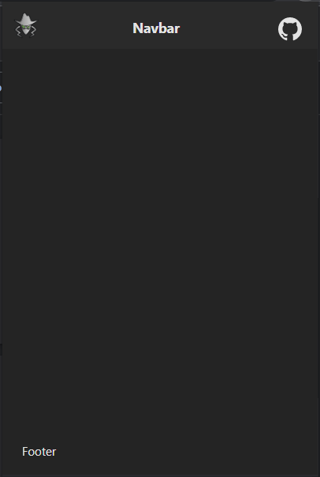
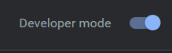
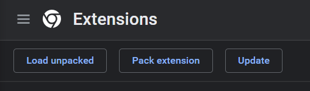
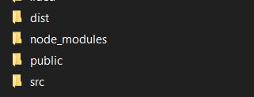
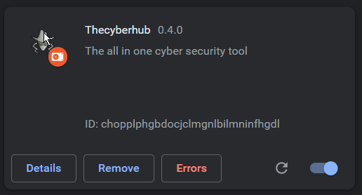
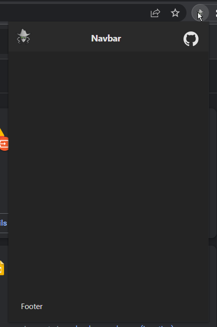
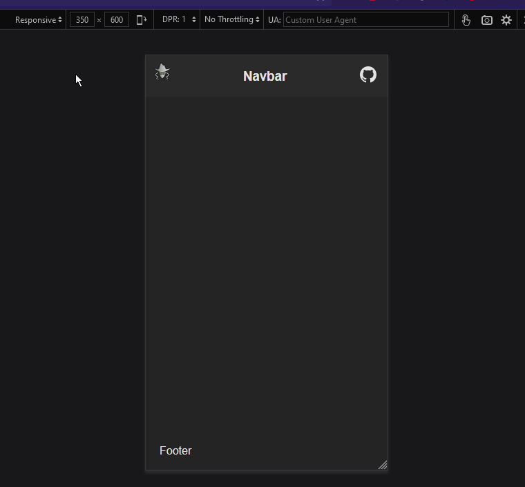

# ThecyberX
web extension

Temporary readme file as a contributing guide.

`npm run build` to build the extension

Open chrome browser and go to extensions

Select `dist` folder 

use 350 x 600 width to get the best result

